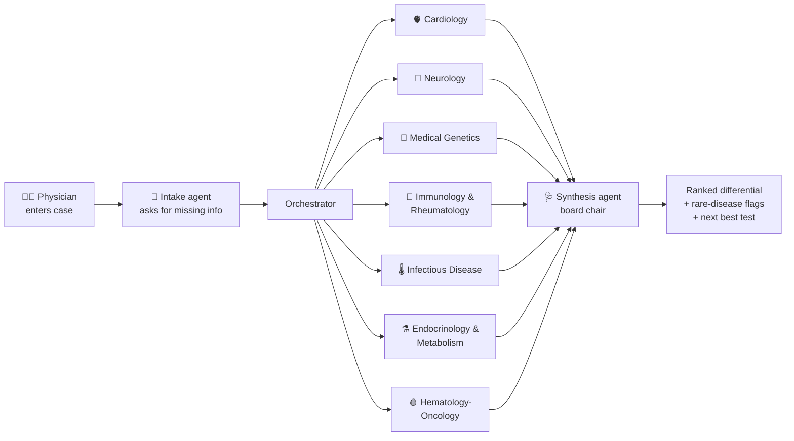

# 🛡 AegisMed

**A virtual board of AI specialist physicians that helps doctors get second opinions on complex and undifferentiated cases.**

Built for the [AMD Developer Hackathon: ACT II](https://lablab.ai/ai-hackathons/amd-developer-hackathon-act-ii) — Track 3 (Unicorn Track), powered by **Google Gemma** on **Fireworks AI** (AMD hardware) and **AMD Developer Cloud**.

> ⚠️ **Medical disclaimer:** AegisMed is a clinical decision-support prototype for licensed physicians. It does not provide medical advice, diagnosis, or treatment. All output must be verified by a qualified clinician.

## The problem

Diagnostic reasoning is distributed across specialties. No single physician can hold all the knowledge needed to confidently work up a complex case. In rare diseases, the stakes are highest — patients wait 5–7 years on average for a correct diagnosis — but the value of a multidisciplinary case conference applies to any undifferentiated or complex presentation.

## The idea

AegisMed recreates the diagnostic power of a **multidisciplinary case conference** — a structured review by specialists across domains — as software a doctor can convene in 60 seconds:

1. The physician enters a patient case (symptoms, history, labs).
2. An **intake agent** reviews it first and asks for any missing high-value details (timeline, family history, exposures, prior tests) — like a clinician taking a focused history before consulting. The physician answers, or skips.
3. **Seven AI specialist agents** — Cardiology, Neurology, Medical Genetics, Immunology & Rheumatology, Infectious Disease, Endocrinology & Metabolism, and Hematology-Oncology — each analyze the case independently and in parallel. Each hunts for rare diseases in its field, but may also say "nothing in my domain" rather than invent a diagnosis.
4. A **synthesis agent** (the "board chair") merges the opinions into a ranked differential diagnosis with rare-disease flags, points of agreement/disagreement, the single most valuable next test, immediate safety actions, and a do-not-miss warning.
5. Throughout, AegisMed grounds itself in **real, verified references** — Orphanet, OMIM, PubMed, and GARD links attached from a knowledge base (never invented by the AI). See [`docs/EVIDENCE.md`](docs/EVIDENCE.md).

**Smart routing keeps it token-efficient:** the same pre-board step that gathers evidence also picks which specialists a case actually needs, so a typical case convenes only 3–4 of the 7 (Medical Genetics is always kept; it falls back to the full board when unsure). Set `SPECIALIST_SELECTION=all` to force all seven. Each agent is the same Gemma model given a different specialist role — cheap to run, easy to extend with more specialties.



## Quickstart

### Option A — Docker (what the judges will use)

```bash
git clone https://github.com/wachirawut2023/AegisMed.git
cd AegisMed
cp .env.example .env        # optional: add your Fireworks API key to .env
docker compose up --build
```

Open **http://localhost:8000**, click **“Load example case”**, then **“Convene the board”**.

### Option B — plain Python (no Docker)

```bash
git clone https://github.com/wachirawut2023/AegisMed.git
cd AegisMed
python3 -m venv .venv
source .venv/bin/activate          # on Windows: .venv\Scripts\activate
pip install -r requirements.txt
uvicorn aegismed.main:app --port 8000
```

Open **http://localhost:8000**.

### Demo mode vs. real AI

With **no API key**, AegisMed runs in **demo mode**: the built-in example case returns realistic pre-written board output so you can explore the full experience at zero cost. To enable the real AI agents, put your [Fireworks AI](https://fireworks.ai) API key in `.env`:

```
FIREWORKS_API_KEY=fw_your_key_here
```

## Evaluation

AegisMed is tested against **real, publicly-licensed rare-disease cases** (from
[RareBench](https://huggingface.co/datasets/chenxz/RareBench) and
[CUPCase](https://huggingface.co/datasets/ofir408/CupCase), both Apache-2.0). Two steps:

```bash
python data/build_dataset.py   # download + convert public cases (no API key needed)
python eval/run_eval.py        # score AegisMed against them (needs your Fireworks key)
```

This produces a headline number — *"the correct diagnosis was surfaced in X% of
held-out cases"* — written to `eval/results.md`. See
[`docs/DATA_AND_EVAL.md`](docs/DATA_AND_EVAL.md) for a beginner-friendly walkthrough
and [`data/SOURCES.md`](data/SOURCES.md) for dataset attribution and licenses.

To compare a fine-tuned model against the base Gemma model and Gemma 4 on the
same cases, use `python eval/compare_models.py --finetuned <model-id>` — see
the ["Comparing models"](docs/DATA_AND_EVAL.md#comparing-models) section.

## Configuration

All settings live in `.env` (see `.env.example`):

| Variable | Default | Meaning |
|---|---|---|
| `FIREWORKS_API_KEY` | *(empty)* | Your Fireworks AI key ($50 free via the AMD AI Developer Program) |
| `MODEL` | `accounts/fireworks/models/gemma-3-27b-it` | Which model powers the agents |
| `DEMO_MODE` | `auto` | `auto` / `true` / `false` — sample output vs. real AI |

## Tech stack

- **Google Gemma** (open-weight LLM) served by **Fireworks AI** on **AMD hardware**
- **AMD Developer Cloud** for hosting/deployment
- **Python 3.11 + FastAPI** backend, single-page vanilla HTML/JS frontend
- **Docker** for one-command, reproducible runs

## Project layout

```
aegismed/
  config.py        # settings from .env
  llm.py           # the one place that calls the AI model
  intake.py        # asks clarifying questions before the board meets
  retrieval.py     # gathers real reference evidence for the specialists
  knowledge.py     # verified citations (Orphanet/OMIM/PubMed) — never invented
  specialists.py   # the seven specialist personas (system prompts)
  orchestrator.py  # retrieval → specialists in parallel → synthesis → citations
  main.py          # FastAPI web server
static/index.html  # the UI
data/              # dataset builder + generated eval/demo cases (public sources)
eval/              # evaluation harness (scores AegisMed on known cases)
docs/              # hackathon guide, architecture, roadmap, checklist, data & eval
```

New here? Start with [`docs/ARCHITECTURE.md`](docs/ARCHITECTURE.md) — it explains every concept in plain language. For the product/market story, see [`docs/MARKET_EXPANSION.md`](docs/MARKET_EXPANSION.md); to integrate the board into another product, see [`docs/API.md`](docs/API.md).

## License

MIT — see [LICENSE](LICENSE).
