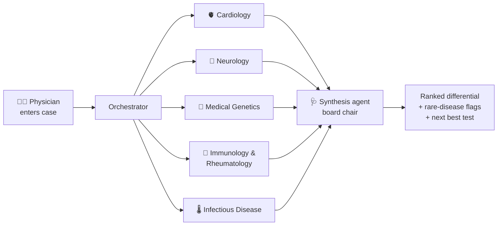

# 🛡 AegisMed

**A virtual board of AI specialist physicians that helps doctors catch rare diseases sooner.**

Built for the [AMD Developer Hackathon: ACT II](https://lablab.ai/ai-hackathons/amd-developer-hackathon-act-ii) — Track 3 (Unicorn Track), powered by **Google Gemma** on **Fireworks AI** (AMD hardware) and **AMD Developer Cloud**.

> ⚠️ **Medical disclaimer:** AegisMed is a clinical decision-support prototype for licensed physicians. It does not provide medical advice, diagnosis, or treatment. All output must be verified by a qualified clinician.

## The problem

A rare disease patient waits **5–7 years on average** for a correct diagnosis, seeing 8+ doctors along the way. The knowledge to diagnose them usually exists — but it is scattered across specialties, and no single physician can hold all of it. Patients fall through the gaps *between* specialties.

## The idea

AegisMed recreates the one thing that reliably catches rare diseases — a **multidisciplinary case conference** — as software a doctor can convene in 60 seconds:

1. The physician enters a patient case (symptoms, history, labs).
2. **Five AI specialist agents** — Cardiology, Neurology, Medical Genetics, Immunology & Rheumatology, Infectious Disease — each analyze the case independently and in parallel, each explicitly hunting for rare diseases in their field.
3. A **synthesis agent** (the "board chair") merges the five opinions into a ranked differential diagnosis with rare-disease flags, points of agreement/disagreement, the single most valuable next test, and a do-not-miss warning.

Each agent is the same Gemma model given a different specialist role — cheap to run, easy to extend with more specialties.



## Quickstart

### Option A — Docker (what the judges will use)

```bash
git clone https://github.com/wachirawut2023/AegisMed.git
cd AegisMed
cp .env.example .env        # optional: add your Fireworks API key to .env
docker compose up --build
```

Open **http://localhost:8000**, click **“Load example case”**, then **“Convene the board”**.

### Option B — plain Python (no Docker)

```bash
git clone https://github.com/wachirawut2023/AegisMed.git
cd AegisMed
python3 -m venv .venv
source .venv/bin/activate          # on Windows: .venv\Scripts\activate
pip install -r requirements.txt
uvicorn aegismed.main:app --port 8000
```

Open **http://localhost:8000**.

### Demo mode vs. real AI

With **no API key**, AegisMed runs in **demo mode**: the built-in example case returns realistic pre-written board output so you can explore the full experience at zero cost. To enable the real AI agents, put your [Fireworks AI](https://fireworks.ai) API key in `.env`:

```
FIREWORKS_API_KEY=fw_your_key_here
```

## Configuration

All settings live in `.env` (see `.env.example`):

| Variable | Default | Meaning |
|---|---|---|
| `FIREWORKS_API_KEY` | *(empty)* | Your Fireworks AI key ($50 free via the AMD AI Developer Program) |
| `MODEL` | `accounts/fireworks/models/gemma-3-27b-it` | Which model powers the agents |
| `DEMO_MODE` | `auto` | `auto` / `true` / `false` — sample output vs. real AI |

## Tech stack

- **Google Gemma** (open-weight LLM) served by **Fireworks AI** on **AMD hardware**
- **AMD Developer Cloud** for hosting/deployment
- **Python 3.11 + FastAPI** backend, single-page vanilla HTML/JS frontend
- **Docker** for one-command, reproducible runs

## Project layout

```
aegismed/
  config.py        # settings from .env
  llm.py           # the one place that calls the AI model
  specialists.py   # the five specialist personas (system prompts)
  orchestrator.py  # runs specialists in parallel + synthesis
  main.py          # FastAPI web server
static/index.html  # the UI
docs/              # hackathon guide, architecture, roadmap, checklist
```

New here? Start with [`docs/ARCHITECTURE.md`](docs/ARCHITECTURE.md) — it explains every concept in plain language.

## License

MIT — see [LICENSE](LICENSE).
