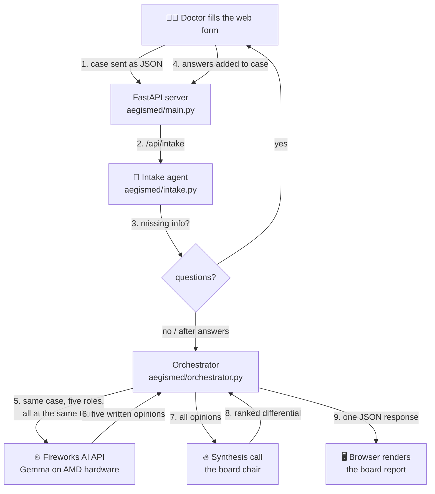

# 🏗 How AegisMed Works — explained from zero

This document assumes **no AI background**. Read it top to bottom once and you
will understand every file in this project.

## First, five words you'll keep seeing

**LLM (Large Language Model).** An AI program that reads text and writes text
back. You give it words, it predicts good next words. Gemma, GPT, and Gemini
are all LLMs. That's the entire magic — everything else is how you *use* it.

**API.** A way for one program to talk to another over the internet. Our code
sends a web request to Fireworks AI ("here is a patient case, answer as a
cardiologist") and gets text back. Like ordering food by phone instead of
cooking: the model runs on Fireworks' AMD servers, not on your laptop.

**System prompt.** A standing instruction given to the LLM before the real
question, e.g. *"You are a board-certified neurologist…"*. The same model
behaves very differently depending on this instruction. This is how one model
becomes five different specialists.

**Agent.** In this project: **one LLM call with a specific role and job**.
Nothing mystical. Our "cardiologist agent" = Gemma + cardiologist system
prompt + the patient case.

**Token.** How LLMs count text — roughly ¾ of a word. APIs charge per token.
A full AegisMed board run uses a few thousand tokens ≈ **less than $0.01**
of your $50 credit.

## The big picture

## The intake step (asks before it acts)

Just like Claude Code asks a couple of clarifying questions before it starts
coding, AegisMed first runs an **intake agent**. When you press "Convene the
board", the app doesn't jump straight to the specialists — it makes one quick
model call that reviews the case and asks for the missing details that would
most change the diagnosis (timeline, family history, exposures, prior tests).
You answer what you can, then the board convenes with the richer case. You can
also **Skip** straight to the diagnosis. If the case is already detailed, the
intake agent asks nothing and the board runs immediately.

After intake, a "board run" is **six LLM calls**: five specialists in parallel,
then one synthesis call that reads their answers.

## Why multiple agents instead of one big question?

You *could* ask one model "act as five doctors." In practice separate calls
work better because:

1. **Independence.** Real second opinions are valuable because they're formed
   separately. Five independent calls can't anchor on each other's first guess.
2. **Focus.** Each call spends its full attention on one specialty's view.
3. **Speed.** The five calls run *simultaneously* (that's the
   `asyncio.gather` in `orchestrator.py`), so five opinions take the time of one.
4. **A great demo story.** Judges can see each specialist's reasoning — it makes
   the product feel like a real case conference.

## What each file does

| File | Plain-language job |
|---|---|
| `aegismed/config.py` | Reads your settings (`.env` file): API key, model name, demo mode. |
| `aegismed/llm.py` | The **only** place that talks to the AI. One function: give it a system prompt + question, get text back. Demo mode short-circuits here. |
| `aegismed/intake.py` | The intake agent: reviews the case and returns clarifying questions (as JSON) before the board meets. |
| `aegismed/specialists.py` | The five specialist personas (system prompts) + the board-chair prompt. **This is where the product's "intelligence" lives — editing these prompts is how you improve AegisMed.** |
| `aegismed/orchestrator.py` | Runs the meeting: formats the case, fires all five specialists at once, then asks the chair to synthesize. |
| `aegismed/main.py` | The web server. Serves the page, exposes `/api/intake` and `/api/diagnose`, validates input. |
| `static/index.html` | Everything the user sees. Plain HTML/JS — no framework to learn. |
| `aegismed/demo_data.py` | Hand-written sample output so the app works with no API key. |

## What is demo mode?

If no API key is configured, `llm.py` returns pre-written answers (for a
classic missed-diagnosis case: **Fabry disease**) instead of calling Fireworks.
The rest of the app — server, UI, JSON shapes — behaves identically. This lets you:

- run and show the app **before** your credits arrive, at zero cost
- keep developing the UI without spending tokens
- have a guaranteed-working fallback during a live demo

## Where AMD fits (judging criterion #4)

- **Fireworks AI serves Gemma on AMD hardware** → every AI call in AegisMed
  already runs on AMD.
- **AMD Developer Cloud** hosts the app itself for the public demo URL.
- Stretch goal (optional, post-foundation): run Gemma directly on an AMD GPU
  with **ROCm + vLLM** on AMD Developer Cloud and point `MODEL`/the API URL at
  it — a strong "meaningful use of AMD platforms" story.

## Ideas for upgrades during hackathon week

Ordered from easiest to hardest:

1. **Tune the prompts** in `specialists.py` (better structure, more specialties).
2. **Add a specialist** — copy one entry in the `SPECIALISTS` dict, write a new
   persona. The orchestrator and UI adapt automatically.
3. **Debate round:** after synthesis, send the chair's report back to each
   specialist for one round of rebuttal, then re-synthesize.
4. **Case history:** store past cases in a small SQLite database.
5. **PDF export** of the board report for the patient chart.
