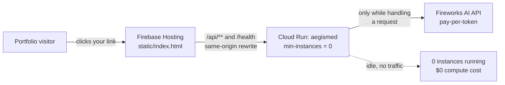

# 🚀 Portfolio deployment — Firebase + Cloud Run (scale-to-zero)

This is a *second* deployment target, added after the hackathon, for showing
AegisMed as a live portfolio piece without paying for an always-on server.
It does not replace the hackathon story in the main [README](../README.md) —
that submission ran on AMD Developer Cloud with Fireworks AI, and that
history stays as-is. This doc covers where the **public demo link** lives now.

## The one insight that makes this free-when-idle

People assume "the model" means a GPU instance you have to keep running.
**It doesn't, here.** Look at `aegismed/llm.py`: every AI call in AegisMed is
an HTTP request to Fireworks AI's *hosted* inference API. Fireworks bills
per token, on their infrastructure — there is no GPU box of yours to leave
running, so there is nothing to "drain your money" on that side no matter
how AegisMed is deployed.

The only thing that actually runs continuously — and could cost money 24/7
— is the small FastAPI container in this repo (`aegismed/main.py`, already
Dockerized). That's a lightweight orchestrator: it serves the page, calls
Fireworks, and returns JSON. It's a perfect fit for a platform that scales
to **zero** running instances when nobody's using it, and starts one up in a
couple of seconds when a request arrives.

That platform is **Cloud Run**.

## Architecture



- **Firebase Hosting** serves `static/index.html` (free tier: 10 GB storage /
  360 MB per day transfer — far more than a portfolio link needs) and,
  via a `rewrite` rule in `firebase.json`, transparently proxies `/api/**`
  and `/health` to the Cloud Run service. Same origin, so the browser's
  existing `fetch('/api/diagnose')` calls in `static/index.html` need **no
  changes**, and the CSP (`connect-src 'self'`) still holds — no CORS
  config needed anywhere.
- **Cloud Run** runs the existing `Dockerfile` as-is. With `min-instances=0`
  (the default — this repo sets it explicitly to make the intent obvious),
  Cloud Run kills the last container a short idle period after the last
  request and bills **nothing** while at zero. The next visitor's request
  triggers a cold start (a few seconds for this app) and gets served.
- **Fireworks AI** stays exactly as it is today — pay-per-token, no idle
  cost, nothing to turn on or off.

Net effect: **when nobody has your portfolio link open, this costs $0.**
When someone visits, it wakes up automatically, answers, and goes back to
sleep — no manual start/stop, no forgotten running instance.

## One-time setup

You need a Google Cloud project (Firebase Hosting and Cloud Run can live in
the same project — go to https://console.firebase.google.com and either
create a new project or "add Firebase" to an existing GCP project).

```bash
# Install the CLIs if you don't have them
npm install -g firebase-tools
# gcloud: https://cloud.google.com/sdk/docs/install

# Authenticate both
gcloud auth login
firebase login

# Point this repo's Firebase config at your project
firebase use --add   # pick your project, alias it "default"
# or edit .firebaserc directly and replace YOUR_FIREBASE_PROJECT_ID

# Enable the APIs Cloud Run needs (one-time per project)
gcloud services enable run.googleapis.com cloudbuild.googleapis.com \
  --project YOUR_PROJECT_ID
```

If `firebase.json`'s hosting `rewrites` region (`us-central1`) doesn't match
where you deploy the Cloud Run service, update both to agree — the region
in `firebase.json` and the `--region` flag below must match.

## Deploy

```bash
PROJECT_ID=your-gcp-project \
REGION=us-central1 \
  ./scripts/deploy.sh
```

No Fireworks API key is asked for or used — this deployment runs
permanently in demo mode (see below), so there's no secret to provide.

This runs two commands (see `scripts/deploy.sh` for the exact flags):

1. `gcloud run deploy` — builds the existing `Dockerfile` with Cloud Build
   and deploys it with `--min-instances 0`.
2. `firebase deploy --only hosting` — publishes `static/index.html` and the
   `/api/**` → Cloud Run rewrite.

You'll get a `*.web.app` / `*.firebaseapp.com` URL (or attach a custom
domain in the Firebase console) — that's the link to put in your portfolio.

Redeploying later (after code changes) is the same one command.

## Keeping the "portfolio committee visits, nobody else" cost near zero

A public link can, in theory, be hit by more than your intended visitors.
A few things in this repo and in the deploy script already bound the
worst case:

- **`--max-instances 3`** in `scripts/deploy.sh` caps how many concurrent
  Cloud Run containers can ever run, so a traffic spike can't scale
  unboundedly.
- **`RATE_LIMIT_PER_MINUTE`** (already in `aegismed/config.py`, default 20)
  throttles the expensive endpoints per client IP.
- **`DEMO_MODE=true`** — `scripts/deploy.sh` sets this explicitly (rather
  than relying on `auto` + "just don't set a key") so the portfolio
  deployment is unconditionally demo mode: every request returns the
  built-in canned board output, a fully working, good-looking demo at
  **zero** per-request cost, with no API key involved anywhere in the
  deploy. If you ever want reviewers to try their own cases against the
  real model, that's a deliberate later change — set `DEMO_MODE=false` and
  add `FIREWORKS_API_KEY` to the Cloud Run service's env vars (ideally via
  Secret Manager rather than a plain env var).
- Set a **budget alert** as a backstop regardless: Cloud Console → Billing →
  Budgets & alerts → create a small budget (e.g. $5) with an email alert.
  Costs nothing itself and catches anything unexpected.

## Known limitation: case storage isn't durable here

`aegismed/cases.py` saves "Save case" results to a local file
(`data/cases.jsonl`) inside the container. Cloud Run's filesystem is
ephemeral — it's wiped when an idle instance scales to zero, and a traffic
spike can spin up more than one instance with separate copies. That's fine
for demoing the board itself, but don't rely on "Save case" persisting
between visits on this deployment. (Swapping that module for Firestore
would fix it, but is a separate change — out of scope here unless you want
that feature to actually work for visitors.)

## Cold start expectations

The first request after a period of no traffic takes a bit longer (typically
a few seconds) while Cloud Run starts a fresh container — this FastAPI app
has no heavyweight startup work, so it's fast to boot. Every request after
that, while the instance stays warm, is normal speed. This is an acceptable
trade for a portfolio link that mostly gets occasional visits; there's
nothing to configure to avoid it without paying for `min-instances >= 1`
(which brings back the always-on cost you're trying to avoid).
